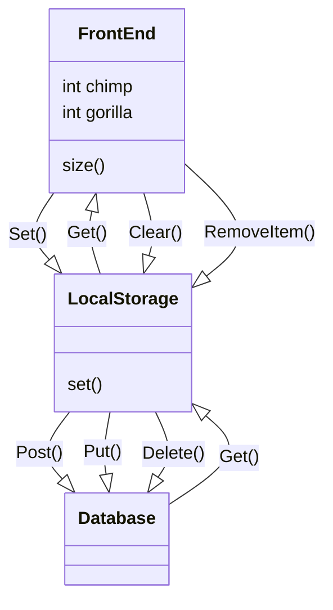

# Database API Design

The database Api allows the front end of an application to store resources in:

- user local storage
- database handled by a backend

The user local storage is a more volatile location to store resource. this is because it is port dependent as such when users will log onto the front end from different devices or ports their resources will not be there. Moreover, the localStorage has a limited storage size of a few hundred Mega bytes. Nevertheless, the key value store database is fast as such it is the first point the application should look for the resources when the users login.

The database should be able to perform CRUD operations on the resources. This will enable a consistent data management system since the key used for storing the data should update existing keys in order to allow the user to update resources

####Software Behavior
_Assuming that a RESTful Api is implemented to connect to the database_

#### CREATE Method
>once the resource is created it can be saved to the local storage using Set(), then the resource will be created in the backend as the local storage api will first try to Put() the resource and if a resource non-existing response is returned the api will Post() it

### READ Method
>when the user tries to access the data the application will look for the resource within local storage first and then try to send a GET request to the database to find the desired resource, if the response is ok the value retrieved will be stored to the database

#### UPDATE Method
>to update the resource the key storing the resource in local storage can  override its value when the Set() method is called on an existing resource,in the backend the resource can be updated by deleting the existing resource with the same key and creating a new resource with the same key but with the new value

#### DELETE Method
>when a resource is deleted this is removed from the database and a delete request will be sent to the backend

